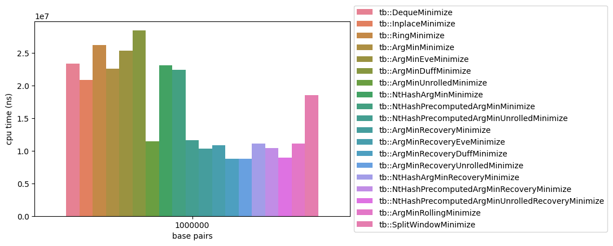

# Minimizer benchmarks
Different implementations for finding robust random minimizers in genomic data.

## Running benchmarks

### Dependencites
- C++20 compliant compiler
  - Support for [C++17 execution policy](https://en.cppreference.com/w/cpp/algorithm/execution_policy_tag_t)
- CMake
- git

- [googletest](https://github.com/google/googletest)
- [benchmark](https://github.com/google/benchmark)
- [eve](https://github.com/jfalcou/eve)

### Build
```bash
git clone https://github.com/tbrekalo/tb-mbench
cd tb-mbench

cmake -Bbuild -DCMAKE_BUILD_TYPE=Release
cmake --build build
```

### Run
```bash
./build/bin/bench
```

## Results

### Benchmarking machine
- 13th Gen Intel(R) Core(TM) i5-13500
- locked at 2.5Ghz
- window length = 11
- kmer length = 21

### Figures
| function                                            |   avg ns per bp |
|:----------------------------------------------------|----------------:|
| tb::NaiveMinimize                                   |       241.645   |
| tb::ArgMinDuffMinimize                              |        28.5821  |
| tb::RingMinimize                                    |        26.21    |
| tb::ArgMinEveMinimize                               |        25.2662  |
| tb::NtHashArgMinMinimize                            |        23.5889  |
| tb::DequeMinimize                                   |        23.5029  |
| tb::NtHashPrecomputedArgMinMinimize                 |        22.9015  |
| tb::ArgMinMinimize                                  |        22.7272  |
| tb::InplaceMinimize                                 |        20.8437  |
| tb::NtHashPrecomputedArgMinUnrolledMinimize         |        11.6283  |
| tb::ArgMinUnrolledMinimize                          |        11.5674  |
| tb::NtHashArgMinRecoveryMinimize                    |        10.925   |
| tb::ArgMinRollingMinimize                           |        10.7311  |
| tb::ArgMinRecoveryEveMinimize                       |        10.4815  |
| tb::NtHashPrecomputedArgMinRecoveryMinimize         |        10.2714  |
| tb::ArgMinRecoveryMinimize                          |        10.2034  |
| tb::ArgMinRecoveryDuffMinimize                      |         8.70449 |
| tb::NtHashPrecomputedArgMinUnrolledRecoveryMinimize |         8.31288 |
| tb::ArgMinRecoveryUnrolledMinimize                  |         8.28768 |


## Reference
- [Winnowing: Local Algorithms for Document Fingerprinting](http://dx.doi.org/10.1145/872769.872770)
- [Reducing storage requirements for biological sequence comparison](https://doi.org/10.1093/bioinformatics/bth408)
- [CURIOUS CODING NtHash](https://curiouscoding.nl/posts/nthash/)
- [Mohamadi, Hamid, Justin Chu, Benjamin P. Vandervalk, and Inanc Birol. 2016. “Nthash: Recursive Nucleotide Hashing.” Bioinformatics 32 (22): 3492–94.](http://dx.doi.org/10.1093/bioinformatics/btw397)